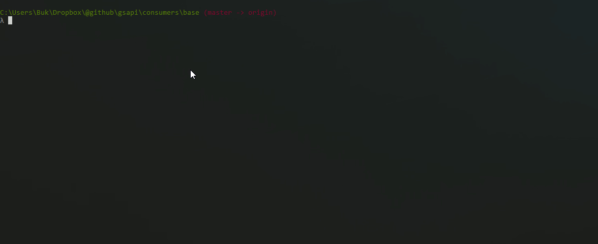
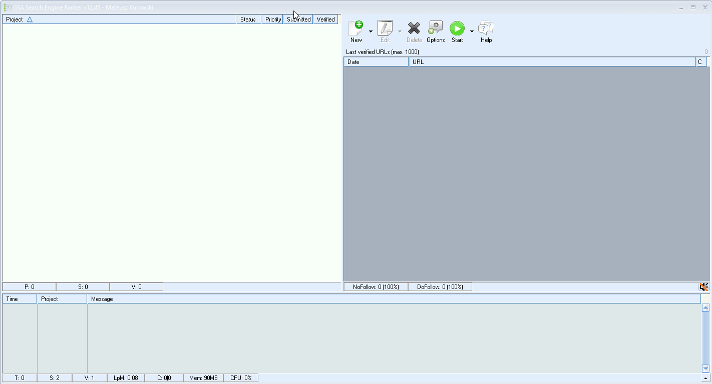
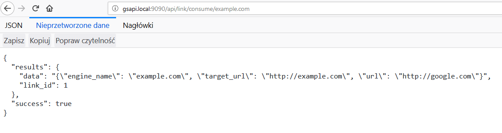
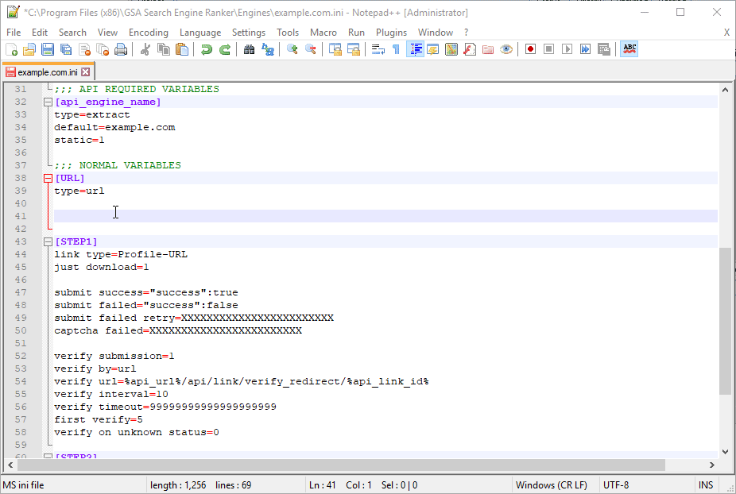
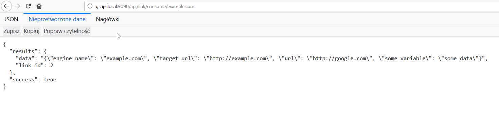
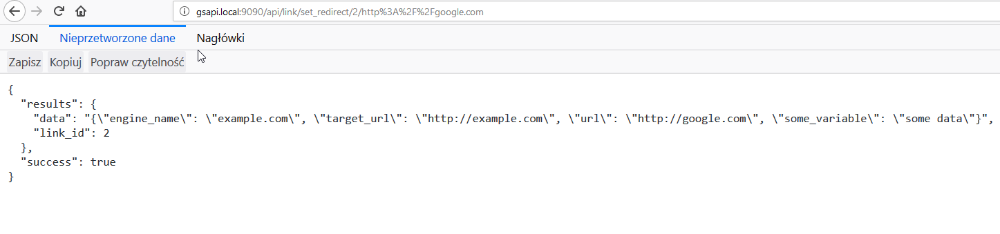
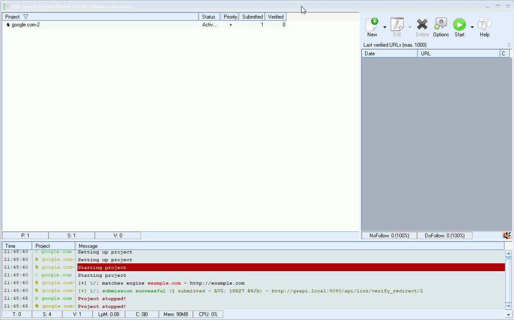

# gsapi

Simple HTTP server for [GSA Search Engine Ranker](https://search-engine-ranker.gsa-online.de/).
<br> It makes possible to integrate 3rd party tools or custom coded scripts instead of using [script-manual](https://docu.gsa-online.de/search_engine_ranker/script_manual) .

Created mainly to integrate [ZennoPoster](http://www.zennolab.com/en/products/zennoposter/pid/29985796-8d87-4518-babb-7dfa3c58eb10) templates.

## How to install:
1. Download and install [Python 3.6.3+](https://www.python.org/downloads/)
2. Download repo and run `install.py`
3. Run `gsapi_server.py`
4. Add to your C:\Windows\System32\drivers\etc\hosts file this line:
- `127.0.0.1	gsapi.local`

## How does it work?
1. Create your new engine, using cookiecutter, lets call this engine "example.com":<br>



2. Paste your new engine into SER /engines/ folder.
3. Run your project:<br>



4. You have script that will create link for you (for example Zennoposter)
5. To know if there's a pending task to create a link, your script will requests endpoint:
- http://gsapi.local:9090/api/link/consume/example.com

```
{
  "results": {
    "data": "{\"engine_name\": \"example.com\", \"target_url\": \"http://example.com\", \"url\": \"http://google.com\"}",
    "link_id": 1
  },
  "success": true
}
```



6. In case there are no tasks, you will receive:<br>


```
{
  "results": "No tasks for example.com",
  "success": false
}
```
6. In case you need an article, or something else, just edit your example.com.ini file:<br>



That's what your consumer will see:

```
{
  "results": {
    "data": "{\"engine_name\": \"example.com\", \"target_url\": \"http://example.com\", \"url\": \"http://google.com\", \"some_variable\": \"some data\"}",
    "link_id": 2
  },
  "success": true
}
```



7. After your script (for example Zennoposter template) builds a link, you just simply have to tell gsapi location of the link:
- for example, if your `link_id is 2` and the url where SER can find url for project is `http:/google.com`, you have to [urlencode](https://www.w3schools.com/tags/ref_urlencode.asp) your link, and send HTTP GET requests to this endpoint:
- http://gsapi.local:9090/api/link/set_redirect/2/http%3A%2F%2Fgoogle.com
```
{
  "results": {
    "data": "{\"engine_name\": \"example.com\", \"target_url\": \"http://example.com\", \"url\": \"http://google.com\", \"some_variable\": \"some data\"}",
    "link_id": 2
  },
  "success": true
}
```



8. Now SER will be redirected to http://google.com:



9. In case your script (ZennoPoster template) get's wrong (ex. your internet connection is down, BAD END), you can set the link_id to "not working", so it can be consumed again, simply call this endpoint:
- http://gsapi.local:9090/api/link/set_not_working/1

````
{
  "results": {
    "data": "{\"engine_name\": \"example.com\", \"target_url\": \"http://example.com\", \"url\": \"http://google.com\"}",
    "link_id": 1
  },
  "success": true
}
````


# helpfull commands and tools:
- [cmder](http://cmder.net/)
- `cd .. && rm -r example.com && cookiecutter . && cd example.com && python paste_into_gsa.py`
